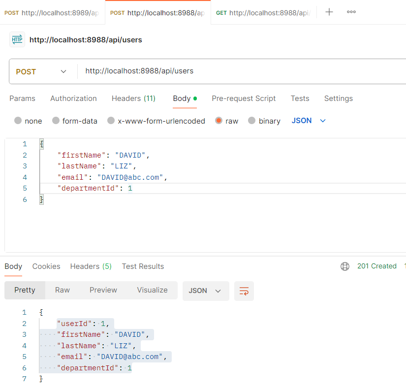
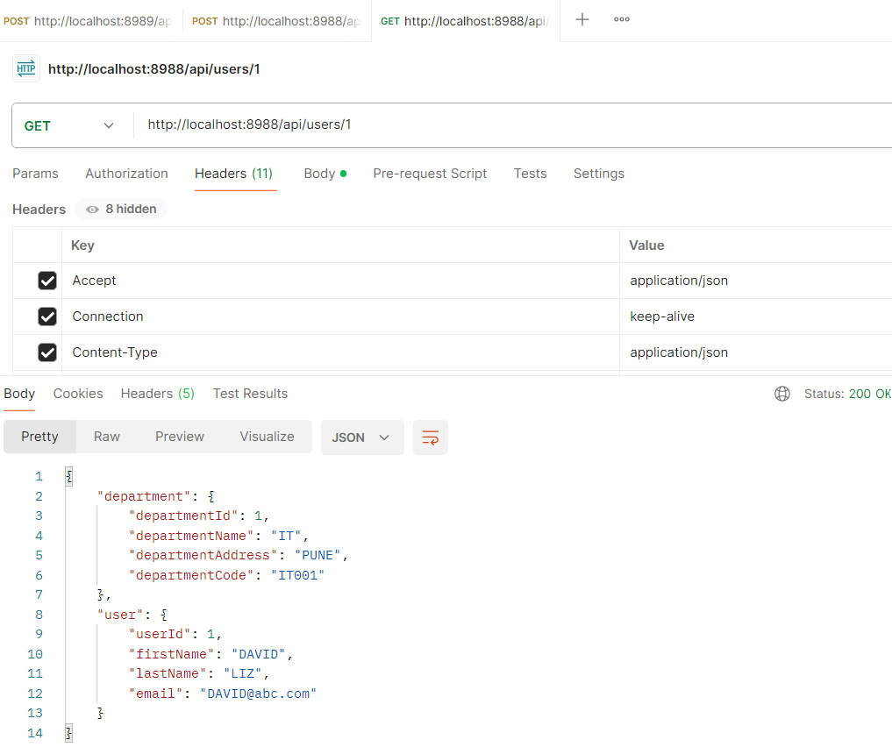

# sp-ms-user-service
Micro service communication using RestTemplate (org.springframework.web.client.RestTemplate).
# User service and Department service
Create two spring boot microservices (sp-ms-department-service and sp-ms-user-service) and how to use RestTemplate class to make synchronous communication between multiple microservices.  
The response contains a Department for a User. This demonstrates that we have successfully made a REST API call from UserService to DepartmentService

# ms communication using RestTemplate
# User service >>HTTP REQUEST>> Department service
# User service <<HTTP RESPONSE<< Department service
